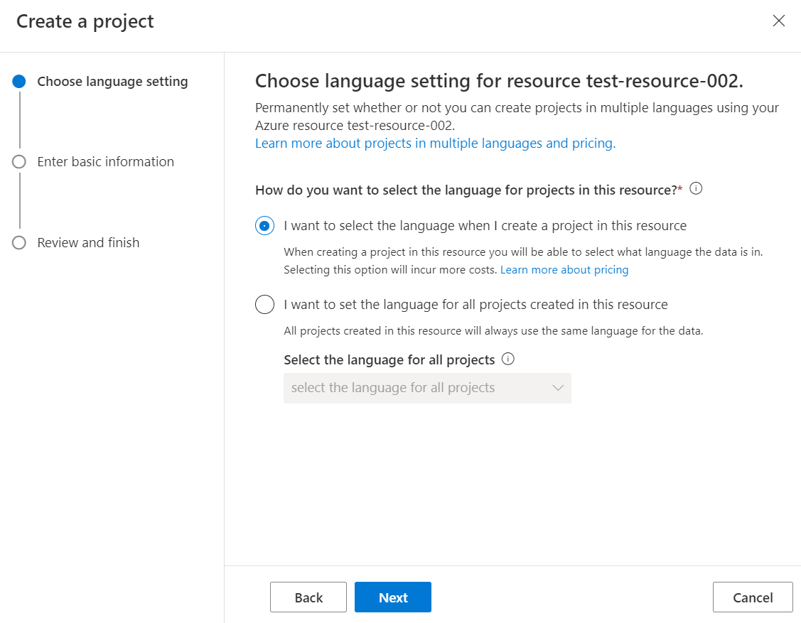

# Create and manage project settings

Question answering allows you to manage your projects/knowledge bases by providing access to the project settings and data sources. If you haven't created a question answering project before we recommend starting with the [getting started article](create-test-deploy.md).

## Prerequisites

> * If you don't have an Azure subscription, [create a free account](https://azure.microsoft.com/free/cognitive-services/) before you begin.
> * A [Language resource](https://aka.ms/create-language-resource) with the custom question answering feature enabled in the Azure portal. Remember your Azure Active Directory ID, Subscription, and language resource name you selected when you created the resource.

## Create a project

1. Sign in to the [Language Studio](https://language.azure.com/) portal with your Azure credentials.

2. Open the [question answering](https://language.azure.com/languageStudio/questionAnswering/projects) page.

3. Select **create new project**.

4. If you are creating the first project associated with your language resource, you have the option of creating future projects with multiple languages for the same resource. If you choose to explicitly set the language to a single language in your first project, you will not be able to modify this setting later and all subsequent projects for that resource will use the language selected during the creation of your first project.

    > [!div class="mx-imgBorder"]
    > 

5. Enter basic project settings:

    |Setting| Value|
    |-------|------|
    |**Name** | Enter your unique project name here ("project" and "knowledge base" refer to the same thing in question answering.) |
    |**Description** | Enter a description for your project |
    |**Source language** | Whether or not this value is greyed out, is dependent on the selection that was made when the first project associated with the language resource was created.  |
    |**Default answer** | The default answer the system will send if there was no answer found for the question. You can change this at any time in Project settings.

## Manage projects

From the main question answering page in Language Studio you can:

- Create projects
- Delete projects
- Export existing projects for backup or to migrate to other language resources
- Import projects/knowledge bases. (The expected file format is a `.zip` file containing a project/knowledge base that was exported in `excel` or `.tsv` format).
- Projects can be ordered by either **Last modified** or **Last published** date.

## Manage sources

1. Select **Manage sources** in the left navigation bar.

1.  There are three types of sources: **URLS**, **Files**, and **Chitchat**

       |Goal|Action|
       |--|--|
       |Add Source|You can add new sources and FAQ content to your project by selecting **Add source** > and choosing **URLs**, **Files**, or **Chitchat**|
       |Delete Source|You can delete existing sources by selecting to the left of the source, which will cause a blue circle with a checkmark to appear > select the trash can icon. |
       |Mark content as unstructured|If you want to mark the uploaded file content as unstructured select **Unstructured content** from the dropdown when adding the source.|
       |Auto-detect| Allow question and answering to attempt to determine if content is structured versus unstructured.|

## Manage large projects

From the **Edit knowledge base page** you can:

* **Search project**: You can search the project by typing in the text box at the top of question answer panel. Hit enter to search on the question, answer, or metadata content.

* **Pagination**: Quickly move through data sources to manage large projects. Page numbers appear at the bottom of the UI and are sometimes off screen.

## Delete project

Deleting a project is a permanent operation. It can't be undone. Before deleting a project, you should export the project from the main question answering page within the Language Studio.

If you share your project with collaborators and then later delete it, everyone loses access to the project.

## Next steps

* [Configure resources](./configure-resources.md)
