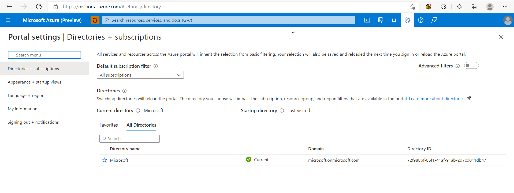
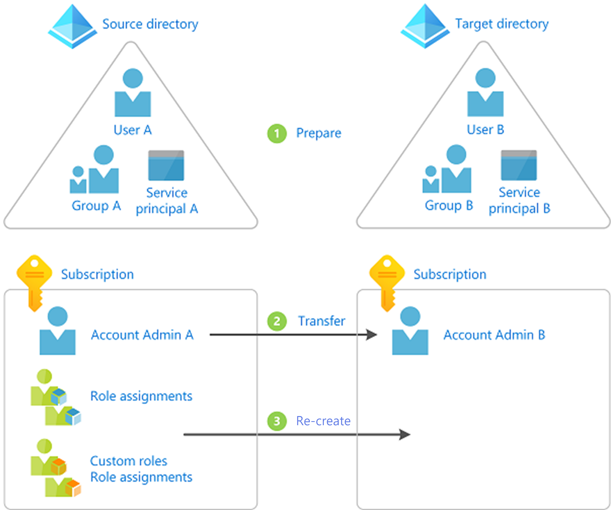
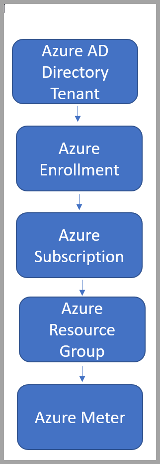
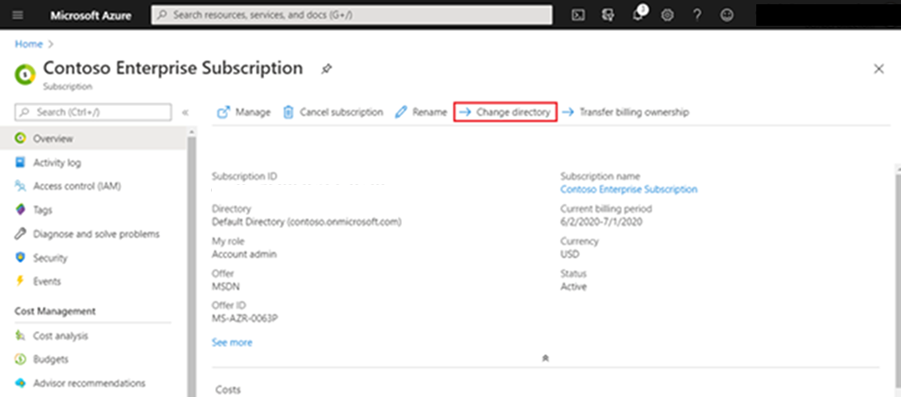
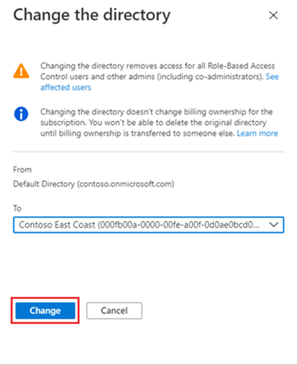

# Change Directory Tenants with your Azure Subscriptions  

Organizations may have several Azure credit subscriptions. Each subscription an organization sets up is associated with an [Azure Active Directory](../../active-directory/fundamentals/active-directory-whatis.md). (Azure AD)  

Azure AD is Microsoft’s cloud-based identity and access management service that helps your employees sign in and access internal and external resources.  

You may need to change the Active Directory you’re working in or [transfer your subscription to another Active Directory](../../role-based-access-control/transfer-subscription.md).  

When activating your subscription, your identity is created based on the email you use. That identity is either associated with your organization’s Active Directory tenant or a new directory tenant is created for that identity. You can see the identity you’re using in the upper right-hand side of your Azure portal.  

  

From here, you can either switch identities or switch directories. You may need to change your identity to access certain directories.  

If the identity you’re logged in as is associated with multiple directories, switch by selecting “Switch directory.” You'll see the directories your current identity is associated with.  

  

Your experience within the portal is highly dependent on the directory associated with the identity you used. To change directory tenants, an Admin will have to add your identity as a user within the target directory.  

## Importance of Changing Your Azure Active Directory Tenant  

When you set up your Azure Credit Subscription through a Visual Studio license, you can use a work email or a personal email to create your identity.  

If you set up your credit subscription using a personal account, your identity and work are isolated from your organization’s active directory. Let’s say you've been working on an app that needs its own subscription to test and learn before deployment. Now, you need access to your organization’s work or references. Changing your directory’s tenant lets you access your organization’s resources and lets them access yours.  

Below is a simple diagram that shows the basic steps taken when you change or transfer your subscription.

  

## Identity and Access Management

Where and how you have access dictates what you see based on your logged in credentials. This access can be given at different levels within the organization’s hierarchy. You can be given access at the directory level, subscription level or within resource groups.  

  

You can see and manage your access levels within Access Control. You can also manage others' access to the subscription depending on your access levels.  

## How to Change your Azure Directory Tenant

To access another Active Directory, you need an active account with the necessary permissions and access to change directory tenants. An admin within the directory tenant you wish to access can either add you as:

* User
* Guest  

Once you’ve been added and given proper permissions, you can switch directories within your subscription.  

1. Sign in and select the subscription you want to use from the [Subscriptions page in Azure portal](https://portal.azure.com/#blade/Microsoft_Azure_Billing/SubscriptionsBlade)  
2. Select “Change Directory”  

     
3. A box will surface to choose the new directory  
4. Select “Change”  

    > [!NOTE]
    > If you don’t have access to the target directory it will not show. After the directory is changed for the subscription, you'll receive a success message.  

    
5. Select “Switch Directories” on the subscription page to access the new directory  

  

You can also access a target directory and change your tenancy by going to the target directory and adding an Admin. Follow [these instructions](/visualstudio/subscriptions/cloud-admin) on how to add an Admin to your subscription. Once that’s done, the Admin has access to both directories and can change the tenant directory for you.  
